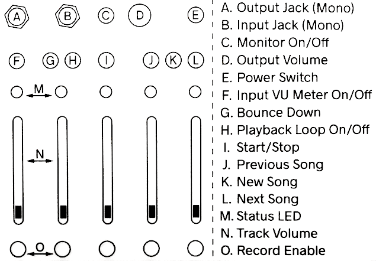
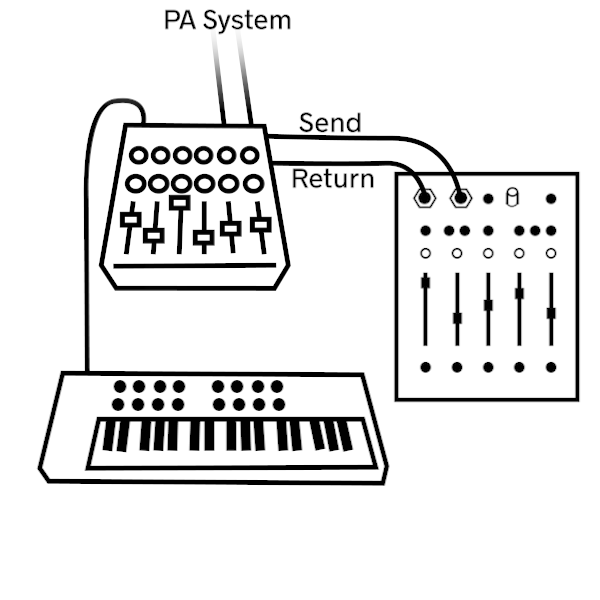
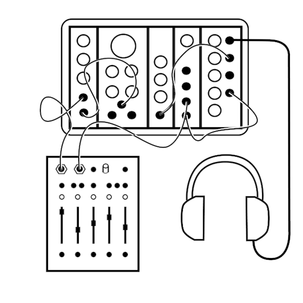
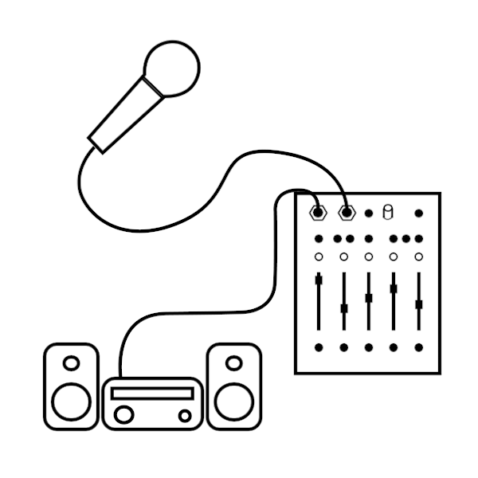

# 5 Moons User Manual

Five moons is a multi track recorder

## Getting Started

You probably want to get started right away! Here are a few steps to use   
1. Connect power  
2. turn on  
3. connect audio out  
4. connect audio in  
5. record a sound  
6. play it back

## The front panel

 

Each jack, button, slider, and LED has a corresponding letter. We'll use these letters frequently in this manual. This chart with labels can be conveniently found on the bottom side of the 5 Moons.

## Instructions

### Power

First connect the USB-C power adapter. Connect the adapter to a power outlet, and then connect its plug to the leftmost port on the back of the 5 Moons. 

Once the 5 Moons is connected to power, press the top-right button. The LEDs will change color and then some will be green. 

The same button is used to power down. Hold the button for a few seconds and see the LEDs change color. Don't worry! Everything you've recorded is saved.

### 1 sound output from the five moons

5 Moons outputs audio from the top-left 3.5mm audio jack. Connect a mono 3.5mm cable to speakers or an amplifier. 

Audio format: 48 kHz, 16-bit.

### 2 sound input to the five moons

Second to top left input 

Press a track button to record or get ready to record.

Press C to monitor.

Hold F to meter. 

Audio format: 48 kHz, 16-bit.

### 3 transport

The play button is here. Play straight or in a loop. Turn looping on while it's playing.

### 4 bounce downs 

Press this button to bounce down. Bouncing starts the moment the button is pressed, and ends once the play button. Your bounce will be playing in its new song. You will see one green LED on the left-most track. Adjust the volume of this track to hear your sounds (if the volume of track was turned down before or during the bounce down, you won't hear your sound without adjusting the slider).
When bouncing, song buttons are disabled.

### 5 using five moons as a hard drive 

I bet you like the songs you've made and would like to hear them on a computer or immediately send to a mastering engineer. If the 5 Moons is playing or recording, press the stop button. If the 5 Moons is powered from a power outlet, turn it off. If it is powered from a computer's usb port, you're halfway there! Connect a USB-C cable (like the one used to power the unit) to a computer's USB port). While 5 Moons is on, not playing, and connected to the computer, press and hold all five track buttons simultaniously 

### 6 jumping through songs

5 Moons comes with some songs on it that you can navitage through. Have a listen to see what you can make with this puppy. The three buttons J and L to navigate back one song, or forward one song. Use K to start a new song. 

Can't jump through songs when bouncing!

### 7 wifi

Owen knows what this does. I think you can file manage wirelessly. Ask him owen@critterandguitari.com

### 8 upload your own song and start from there

Just as you can move songs and files from 5 Moons to a computer, you can move songs and files from a computer to 5 Moons. Use something you've already made as a starting point for a new 5 Moons creation. 

## Setup Examples

There are so many ways to use 5 Moons. Here are some examples of setups that nurture fun.

### Guitar pedal

Connect an electric guitar to the input and a guitar amp to the output. Use 5 Moons as a guitar mutlitracker or as a 5-channel loop. Connect it to other pedals for a big rig.

 

### Techno Live Set

Is it your turn at Panorama Bar? Connect 5 Moons to a mixer via Send and Return. Any instrument connected to the mixer can be sent to 5 Moons to build a loop, harmonize, or even just to record your set.

 

### Modular

While not technically a eurorack module, 5 Moons has 3.5mm TS input and output, so it's basically a eurorack module for your desk. Patch a module into the input and send 5 Moons back out to another module! Turn monophonic oscillators into 5-voice polysynths! 

 

### Living room

Tour got you beat? Skip studio day and hang on the couch with your friends. Connect a mic to the input and send the output to home speakers. Lay down some acapella beats and freestyles. 

 

